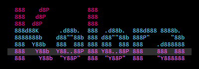
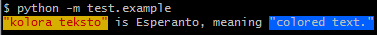

======
kolora
======

-----------------------------------------------------
"kolora teksto" is Esperanto, meaning "colored text."
-----------------------------------------------------
Use method chain to make colored text in terminal.

example :

.. code-block:: python

  from kolora import Kolora

  txt = Kolora()\
      ('"kolora teksto"', fg='Maroon', bg="#d7af00")\
      (' is Esperanto, meaning ', reset=True)\
      ('"colored text."', fg='Silver', bg="#005fff").text

  print(txt)

